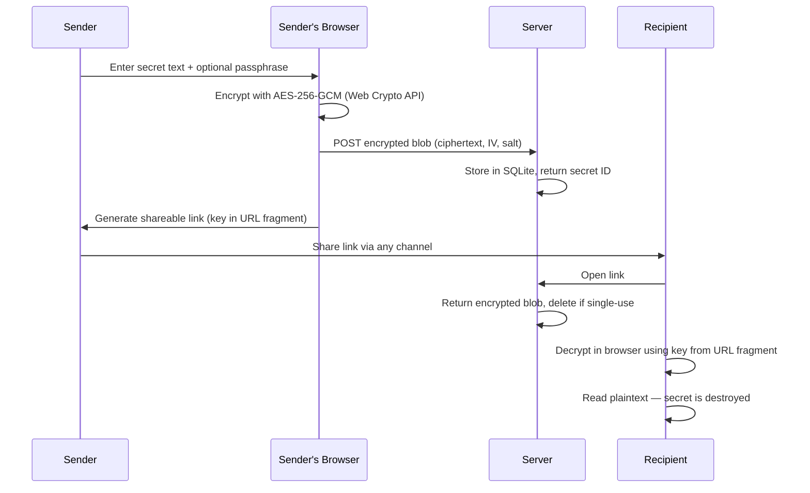

# 🔑 One-Pass-Key

**Secure one-time secret sharing with end-to-end encryption**

[🇷🇺 Русский](./README.ru.md)

---

## Overview

One-Pass-Key is a self-hosted, lightweight service for sharing sensitive text — passwords, API keys, tokens, private messages — via encrypted one-time links. The server **never sees plaintext**; all encryption and decryption happens entirely in the browser using the Web Crypto API.

Share a link. Once opened, the secret is gone.

## How It Works



**Key insight:** The encryption key is embedded in the URL fragment (`#`). URL fragments are **never sent to the server**, so the server cannot decrypt your secrets — even if compromised.

## Security Architecture

| Layer | Protection |
|-------|-----------|
| **Encryption** | AES-256-GCM via Web Crypto API (FIPS 140-2 compliant) |
| **Key management** | Key embedded in URL fragment, never reaches the server |
| **Passphrase** | PBKDF2 with 600,000 iterations + random 16-byte salt |
| **Transport** | Security headers (CSP, HSTS, COOP, CORP, COEP) |
| **Rate limiting** | 60 req/min per IP; 5 passphrase attempts per secret / 15 min |
| **Payload limit** | 64 KB max per request |
| **Data storage** | Encrypted blobs only, auto-expired by TTL |
| **Docker** | Read-only filesystem, `no-new-privileges`, non-root user |

The server is designed to be a **dumb encrypted blob store**. It cannot read your secrets.

## Features

- 🔐 **End-to-end encryption** — AES-256-GCM, keys never leave the browser
- 🔗 **One-time links** — auto-destruct after reading
- 🔑 **Passphrase protection** — optional extra layer with PBKDF2 key derivation
- ⏱ **Configurable TTL** — 1 hour, 24 hours, or 7 days
- 🐳 **Single Docker container** — zero-config deployment
- 🛡 **Security-hardened** — rate limiting, CSP, HSTS, read-only container
- 🪶 **Lightweight** — Hono + SQLite + Svelte, runs on 256 MB RAM
- 🌐 **REST API** — create and retrieve secrets programmatically

## Quick Start

### Docker (Recommended)

```bash
docker run -d \
  --name one-pass-key \
  -p 3080:3000 \
  -v secret-data:/data \
  -e CORS_ORIGINS="https://yourdomain.com" \
  --restart unless-stopped \
  ghcr.io/timik232/one-pass-key:latest
```

Open `http://localhost:3080` and start sharing secrets.

### Docker Compose

```yaml
services:
  app:
    image: ghcr.io/timik232/one-pass-key:latest
    build: .
    ports:
      - "3080:3000"
    volumes:
      - secret-data:/data
    environment:
      - CORS_ORIGINS=https://yourdomain.com
    restart: unless-stopped

volumes:
  secret-data:
```

```bash
docker compose up -d
```

## Configuration

All configuration is done via environment variables:

| Variable | Default | Description |
|----------|---------|-------------|
| `PORT` | `3000` | Server listen port |
| `DB_PATH` | `./secrets.db` | Path to SQLite database file |
| `CORS_ORIGINS` | *(empty)* | Comma-separated allowed origins. Supports regex: `/^https:\/\/.*\.example\.com$/` |
| `NODE_ENV` | `development` | Set to `production` to enable HSTS header |
| `NODE_OPTIONS` | *(none)* | Node.js flags (e.g., `--max-old-space-size=256`) |

### CORS Examples

```bash
# Single origin
CORS_ORIGINS=https://secrets.example.com

# Multiple origins
CORS_ORIGINS=https://secrets.example.com,https://alt.example.com

# Regex pattern (enclose in slashes)
CORS_ORIGINS=/^https:\/\/.*\.example\.com$/
```

## Development

### Prerequisites

- **Node.js** 22+
- **npm** 10+

### Setup

```bash
# Install all dependencies (monorepo workspaces)
npm ci

# Start server (with hot reload)
npm run dev --workspace=server

# Start client (with hot reload, proxies /api to server)
npm run dev --workspace=client
```

The client runs on `http://localhost:5173` and proxies API requests to the server at `http://localhost:3000`.

### Build

```bash
# Build everything (client SPA + server)
docker compose build
```

Or build individually:

```bash
npm run build --workspace=client
npm run build --workspace=server
```

### Tests

```bash
npm test --workspace=server
```

## API Reference

Base path: `/api/secrets`

### Create a Secret

```http
POST /api/secrets
Content-Type: application/json

{
  "encrypted_data": "base64url-encoded-ciphertext",
  "iv": "base64url-encoded-iv",
  "salt": "base64url-encoded-salt",
  "has_passphrase": true,
  "single_use": true,
  "ttl_seconds": 86400
}
```

**Response** `201 Created`

```json
{
  "id": "a1b2c3d4e5f6...",
  "expires_at": "2025-05-03 12:00:00"
}
```

| Field | Type | Required | Description |
|-------|------|----------|-------------|
| `encrypted_data` | string | ✅ | Base64url-encoded AES-256-GCM ciphertext |
| `iv` | string | ✅ | Base64url-encoded 12-byte initialization vector |
| `salt` | string | ❌ | Base64url-encoded 16-byte salt (for passphrase) |
| `has_passphrase` | boolean | ✅ | Whether a passphrase protects this secret |
| `single_use` | boolean | ❌ | Delete after first read (default: `true`) |
| `ttl_seconds` | number | ✅ | Time-to-live: `3600` (1h), `86400` (24h), or `604800` (7d) |

### Get Secret Metadata

```http
GET /api/secrets/:id/meta
```

**Response** `200 OK`

```json
{
  "id": "a1b2c3d4e5f6...",
  "has_passphrase": true,
  "single_use": true,
  "expires_at": "2025-05-03 12:00:00"
}
```

Returns metadata without revealing the encrypted content. Use this to check if a secret exists and whether a passphrase is required.

### Read a Secret

```http
GET /api/secrets/:id
```

**Response** `200 OK`

```json
{
  "id": "a1b2c3d4e5f6...",
  "encrypted_data": "base64url-encoded-ciphertext",
  "iv": "base64url-encoded-iv",
  "salt": "base64url-encoded-salt",
  "has_passphrase": true,
  "single_use": true
}
```

If `single_use` is `true`, the secret is **permanently deleted** from the server after this request.

### Health Check

```http
GET /api/secrets/health
```

**Response** `200 OK`

```json
{
  "status": "ok"
}
```

### Error Responses

| Status | Body | Description |
|--------|------|-------------|
| `400` | `{ "error": "Missing required fields" }` | Invalid request body |
| `404` | `{ "error": "Secret not found, expired, or unavailable" }` | Invalid ID or expired |
| `429` | `{ "error": "rate_limit_exceeded", "message": "..." }` | Rate limit exceeded |

## Tech Stack

| Component | Technology |
|-----------|-----------|
| **Server** | [Hono](https://hono.dev) — fast web framework for Node.js |
| **Database** | [better-sqlite3](https://github.com/WiseLibs/better-sqlite3) — SQLite3 for Node.js |
| **Client** | [Svelte 5](https://svelte.dev) — reactive UI framework |
| **Build** | [Vite](https://vite.dev) — next-gen frontend tooling |
| **Crypto** | [Web Crypto API](https://developer.mozilla.org/en-US/docs/Web/API/Web_Crypto_API) — browser-native cryptography |
| **Runtime** | [Node.js](https://nodejs.org) 22 |
| **Container** | Docker (multi-stage build, 3 stages) |

## Project Structure

```
one-pass-key/
├── client/                 # Svelte 5 SPA
│   ├── src/
│   │   ├── components/     # UI components (forms, views, prompts)
│   │   ├── lib/
│   │   │   ├── api.ts      # API client (fetch wrapper)
│   │   │   ├── crypto.ts   # AES-256-GCM encrypt/decrypt
│   │   │   ├── types.ts    # TypeScript interfaces
│   │   │   └── utils.ts    # Base64url encoding helpers
│   │   ├── pages/          # CreatePage, ViewPage
│   │   └── styles/         # Global CSS
│   └── vite.config.ts      # Dev proxy → server
├── server/                 # Hono API server
│   └── src/
│       ├── db/
│       │   ├── connection.ts   # SQLite setup (WAL mode)
│       │   ├── repository.ts   # CRUD operations
│       │   └── schema.ts       # Table migrations
│       ├── middleware/
│       │   ├── cors.ts          # Configurable CORS
│       │   ├── error-handler.ts # Global error handler
│       │   ├── payload-limit.ts # 64KB request limit
│       │   ├── rate-limit.ts    # IP + passphrase rate limiting
│       │   └── security-headers.ts # CSP, HSTS, etc.
│       ├── routes/
│       │   └── secrets.ts       # Secret CRUD endpoints
│       ├── types.ts             # Shared TypeScript types
│       └── index.ts             # App entry + static serving
├── Dockerfile              # Multi-stage production build
├── docker-compose.yml      # One-command deployment
└── package.json            # npm workspaces root
```

## License

[MIT](./LICENSE)
