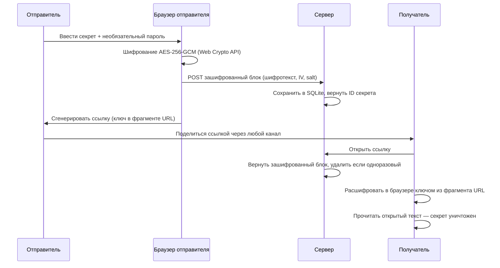

# 🔑 One-Pass-Key

**Безопасный обмен секретами через одноразовые ссылки со сквозным шифрованием**

[🇬🇧 English](./README.md)

---

## Обзор

One-Pass-Key — это легковесный self-hosted сервис для безопасной передачи конфиденциальных данных — паролей, API-ключей, токенов, личных сообщений — через зашифрованные одноразовые ссылки. Сервер **никогда не видит открытый текст**; всё шифрование и расшифрование происходит исключительно в браузере с помощью Web Crypto API.

Поделился ссылкой — после прочтения секрет уничтожен.

## Как это работает



**Ключевой момент:** Ключ шифрования встроен в фрагмент URL (`#`). Фрагменты URL **никогда не отправляются на сервер**, поэтому сервер не может расшифровать ваши секреты — даже при компрометации.

## Архитектура безопасности

| Уровень | Защита |
|---------|--------|
| **Шифрование** | AES-256-GCM через Web Crypto API (соответствует FIPS 140-2) |
| **Управление ключами** | Ключ встроен в фрагмент URL, никогда не достигает сервера |
| **Пароль** | PBKDF2 с 600 000 итераций + случайная 16-байтовая соль |
| **Транспорт** | Заголовки безопасности (CSP, HSTS, COOP, CORP, COEP) |
| **Ограничение частоты** | 60 запросов/мин на IP; 5 попыток ввода пароля на секрет / 15 мин |
| **Лимит нагрузки** | Максимум 64 КБ на запрос |
| **Хранение данных** | Только зашифрованные блоки, автоудаление по TTL |
| **Docker** | Файловая система только для чтения, `no-new-privileges`, непривилегированный пользователь |

Сервер спроектирован как **простое хранилище зашифрованных блоков**. Он не может прочитать ваши секреты.

## Возможности

- 🔐 **Сквозное шифрование** — AES-256-GCM, ключи никогда не покидают браузер
- 🔗 **Одноразовые ссылки** — автоудаление после прочтения
- 🔑 **Защита паролем** — дополнительный слой с PBKDF2 деривацией ключа
- ⏱ **Настраиваемый TTL** — 1 час, 24 часа или 7 дней
- 🐳 **Один Docker-контейнер** — развёртывание без настройки
- 🛡 **Усиленная безопасность** — ограничение частоты запросов, CSP, HSTS, read-only контейнер
- 🪶 **Легковесный** — Hono + SQLite + Svelte, работает на 256 МБ RAM
- 🌐 **REST API** — создавайте и получайте секреты программно

## Быстрый старт

### Docker (рекомендуется)

```bash
docker run -d \
  --name one-pass-key \
  -p 3080:3000 \
  -v secret-data:/data \
  -e CORS_ORIGINS="https://yourdomain.com" \
  --restart unless-stopped \
  ghcr.io/timik232/one-pass-key:latest
```

Откройте `http://localhost:3080` и начните делиться секретами.

### Docker Compose

```yaml
services:
  app:
    image: ghcr.io/timik232/one-pass-key:latest
    build: .
    ports:
      - "3080:3000"
    volumes:
      - secret-data:/data
    environment:
      - CORS_ORIGINS=https://yourdomain.com
    restart: unless-stopped

volumes:
  secret-data:
```

```bash
docker compose up -d
```

## Конфигурация

Вся конфигурация осуществляется через переменные окружения:

| Переменная | По умолчанию | Описание |
|------------|--------------|----------|
| `PORT` | `3000` | Порт сервера |
| `DB_PATH` | `./secrets.db` | Путь к файлу базы данных SQLite |
| `CORS_ORIGINS` | *(пусто)* | Разрешённые источники через запятую. Поддерживает regex: `/^https:\/\/.*\.example\.com$/` |
| `NODE_ENV` | `development` | Установите `production` для включения заголовка HSTS |
| `NODE_OPTIONS` | *(нет)* | Флаги Node.js (например, `--max-old-space-size=256`) |

### Примеры CORS

```bash
# Один источник
CORS_ORIGINS=https://secrets.example.com

# Несколько источников
CORS_ORIGINS=https://secrets.example.com,https://alt.example.com

# Regex-шаблон (заключить в слеши)
CORS_ORIGINS=/^https:\/\/.*\.example\.com$/
```

## Разработка

### Требования

- **Node.js** 22+
- **npm** 10+

### Установка

```bash
# Установить все зависимости (monorepo workspaces)
npm ci

# Запустить сервер (с горячей перезагрузкой)
npm run dev --workspace=server

# Запустить клиент (с горячей перезагрузкой, прокси /api к серверу)
npm run dev --workspace=client
```

Клиент запускается на `http://localhost:5173` и проксирует API-запросы к серверу на `http://localhost:3000`.

### Сборка

```bash
# Собрать всё (клиент SPA + сервер)
docker compose build
```

Или собрать отдельно:

```bash
npm run build --workspace=client
npm run build --workspace=server
```

### Тесты

```bash
npm test --workspace=server
```

## Справочник API

Базовый путь: `/api/secrets`

### Создать секрет

```http
POST /api/secrets
Content-Type: application/json

{
  "encrypted_data": "base64url-шифротекст",
  "iv": "base64url-iv",
  "salt": "base64url-salt",
  "has_passphrase": true,
  "single_use": true,
  "ttl_seconds": 86400
}
```

**Ответ** `201 Created`

```json
{
  "id": "a1b2c3d4e5f6...",
  "expires_at": "2025-05-03 12:00:00"
}
```

| Поле | Тип | Обязательный | Описание |
|------|-----|-------------|----------|
| `encrypted_data` | string | ✅ | Шифротекст AES-256-GCM в кодировке base64url |
| `iv` | string | ✅ | 12-байтовый вектор инициализации в кодировке base64url |
| `salt` | string | ❌ | 16-байтовая соль в кодировке base64url (для пароля) |
| `has_passphrase` | boolean | ✅ | Защищён ли секрет паролем |
| `single_use` | boolean | ❌ | Удалить после первого чтения (по умолчанию: `true`) |
| `ttl_seconds` | number | ✅ | Время жизни: `3600` (1ч), `86400` (24ч) или `604800` (7д) |

### Получить метаданные секрета

```http
GET /api/secrets/:id/meta
```

**Ответ** `200 OK`

```json
{
  "id": "a1b2c3d4e5f6...",
  "has_passphrase": true,
  "single_use": true,
  "expires_at": "2025-05-03 12:00:00"
}
```

Возвращает метаданные без раскрытия зашифрованного содержимого. Используйте для проверки существования секрета и необходимости ввода пароля.

### Прочитать секрет

```http
GET /api/secrets/:id
```

**Ответ** `200 OK`

```json
{
  "id": "a1b2c3d4e5f6...",
  "encrypted_data": "base64url-шифротекст",
  "iv": "base64url-iv",
  "salt": "base64url-salt",
  "has_passphrase": true,
  "single_use": true
}
```

Если `single_use` равен `true`, секрет **безвозвратно удаляется** с сервера после этого запроса.

### Проверка здоровья

```http
GET /api/secrets/health
```

**Ответ** `200 OK`

```json
{
  "status": "ok"
}
```

### Ответы об ошибках

| Статус | Тело | Описание |
|--------|------|----------|
| `400` | `{ "error": "Missing required fields" }` | Некорректное тело запроса |
| `404` | `{ "error": "Secret not found, expired, or unavailable" }` | Неверный ID или срок истёк |
| `429` | `{ "error": "rate_limit_exceeded", "message": "..." }` | Превышен лимит запросов |

## Технологический стек

| Компонент | Технология |
|-----------|-----------|
| **Сервер** | [Hono](https://hono.dev) — быстрый веб-фреймворк для Node.js |
| **База данных** | [better-sqlite3](https://github.com/WiseLibs/better-sqlite3) — SQLite3 для Node.js |
| **Клиент** | [Svelte 5](https://svelte.dev) — реактивный UI-фреймворк |
| **Сборка** | [Vite](https://vite.dev) — инструмент нового поколения |
| **Криптография** | [Web Crypto API](https://developer.mozilla.org/ru/docs/Web/API/Web_Crypto_API) — встроенная криптография браузера |
| **Среда выполнения** | [Node.js](https://nodejs.org) 22 |
| **Контейнер** | Docker (многостадийная сборка, 3 стадии) |

## Структура проекта

```
one-pass-key/
├── client/                 # SPA на Svelte 5
│   ├── src/
│   │   ├── components/     # UI-компоненты (формы, просмотры, промпты)
│   │   ├── lib/
│   │   │   ├── api.ts      # API-клиент (обёртка fetch)
│   │   │   ├── crypto.ts   # Шифрование/расшифрование AES-256-GCM
│   │   │   ├── types.ts    # TypeScript-интерфейсы
│   │   │   └── utils.ts    # Утилиты кодирования base64url
│   │   ├── pages/          # CreatePage, ViewPage
│   │   └── styles/         # Глобальные CSS-стили
│   └── vite.config.ts      # Дев-прокси → сервер
├── server/                 # API-сервер на Hono
│   └── src/
│       ├── db/
│       │   ├── connection.ts   # Настройка SQLite (режим WAL)
│       │   ├── repository.ts   # CRUD-операции
│       │   └── schema.ts       # Миграции таблиц
│       ├── middleware/
│       │   ├── cors.ts          # Настраиваемый CORS
│       │   ├── error-handler.ts # Глобальный обработчик ошибок
│       │   ├── payload-limit.ts # Лимит запроса 64 КБ
│       │   ├── rate-limit.ts    # Ограничение частоты по IP и паролю
│       │   └── security-headers.ts # CSP, HSTS и т.д.
│       ├── routes/
│       │   └── secrets.ts       # CRUD-эндпоинты секретов
│       ├── types.ts             # Общие TypeScript-типы
│       └── index.ts             # Точка входа + раздача статики
├── Dockerfile              # Многостадийная production-сборка
├── docker-compose.yml      # Развёртывание одной командой
└── package.json            # Корень npm workspaces
```

## Лицензия

[MIT](./LICENSE)
